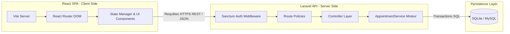
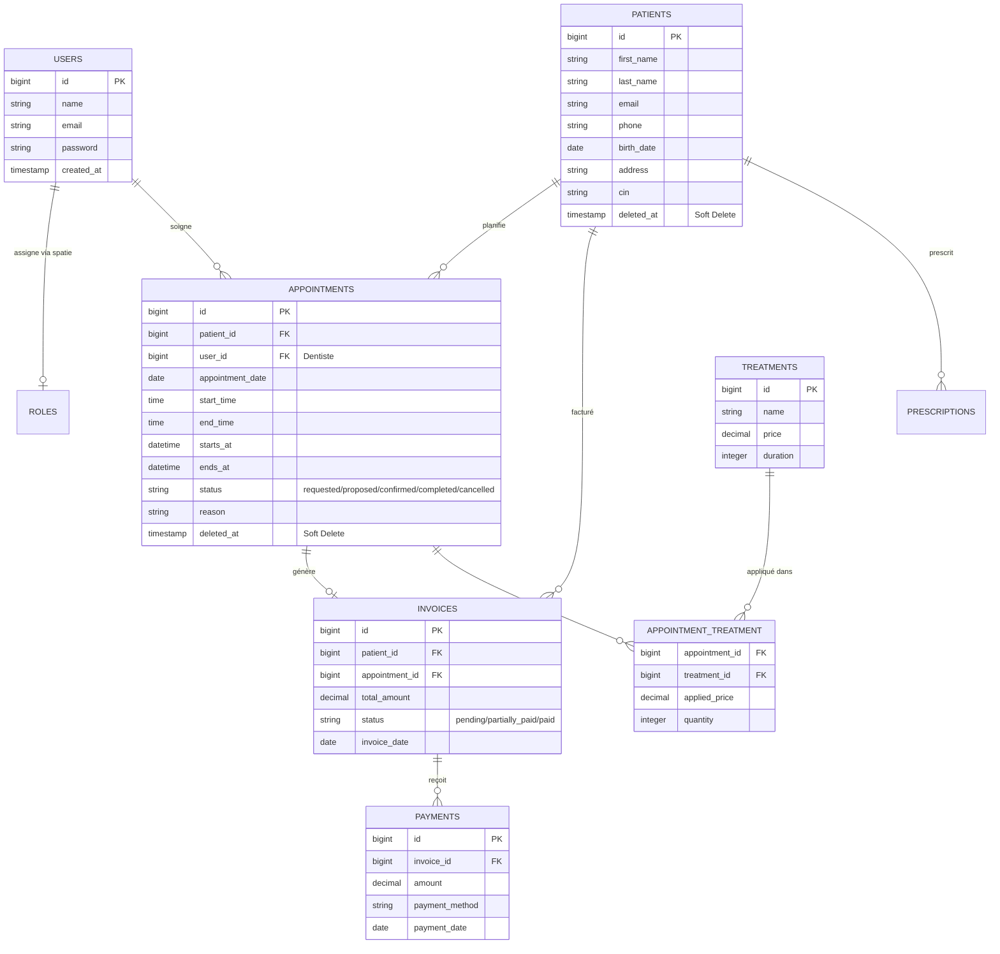
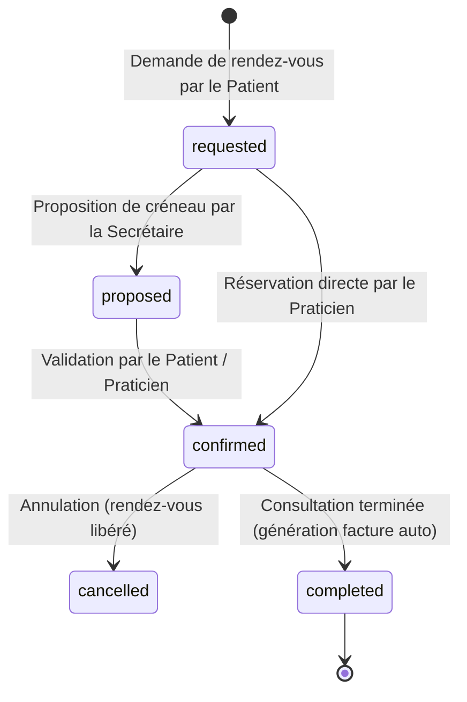

# 🎓 Rapport de Projet Académique
## *DentistPro : Plateforme Intégrée de Gestion Clinique et Administrative pour Cabinets Dentaires*

---

> **Auteur :** Abdessamad KAF  
> **Cadre :** Projet Académique de Fin d'Études / Validation de Module  
> **Technologies Clés :** Laravel 12, React 18, Vite, Spatie Roles, TailwindCSS, PHPUnit  
> **Date de publication :** Mai 2026  
> **Statut de validation :** ✅ 100% des tests unitaires et fonctionnels validés (41 tests, 75 assertions)

---

## 📝 Résumé Exécutif
Ce rapport présente la conception et l'implémentation de **DentistPro**, une solution logicielle innovante à architecture découplée (API Laravel & SPA React) dédiée à la transformation numérique des cabinets dentaires haut de gamme. Le projet résout des défis critiques liés à la planification intelligente d'agenda (moteur d'évitement de conflits d'horaires), à la gestion sécurisée des dossiers cliniques (historique des actes FDI) et à la conformité financière (calcul de facturation dynamique et règlements). La sécurité a été placée au cœur de la conception, exploitant le contrôle d'accès basé sur les rôles (RBAC) via Spatie et des politiques de sécurité strictes au niveau de l'API.

---

## Table des Matières
1. [Introduction & Contexte](#1-introduction--contexte)
2. [Analyse des Besoins & Cahier des Charges](#2-analyse-des-besoins--cahier-des-charges)
3. [Architecture Système & Conception](#3-architecture-système--conception)
4. [Moteur de Planification sans Conflit](#4-moteur-de-planification-sans-conflit)
5. [Sécurité, Rôles et Permissions (RBAC)](#5-sécurité-rôles-et-permissions-rbac)
6. [Réalisation Technique & Design System](#6-réalisation-technique--design-system)
7. [Validation par la Suite de Tests (QA)](#7-validation-par-la-suite-de-tests-qa)
8. [Conclusion & Perspectives](#8-conclusion--perspectives)

---

## 1. Introduction & Contexte

### 1.1 Contexte du Projet
La gestion quotidienne d'un cabinet dentaire moderne implique la coordination en temps réel de multiples acteurs (dentistes, assistantes, secrétaires, patients) et flux complexes de données (actes bucco-dentaires FDI, prescriptions médicales, facturation dynamique, règlements partiels). Les solutions classiques souffrent fréquemment de problèmes de synchronisation, d'interfaces utilisateur vieillissantes non réactives sur terminaux mobiles, et d'un manque de rigueur dans l'évitement automatique des doubles réservations ou des chevauchements d'horaires des praticiens.

### 1.2 Objectifs
L'objectif de **DentistPro** est de concevoir un système d'information robuste, hautement disponible et sécurisé, permettant de :
- Centraliser et fluidifier la communication interne.
- Automatiser la validation temporelle lors des prises de rendez-vous.
- Assurer une traçabilité totale des interventions et des transactions financières (génération automatique de factures à l'achèvement des soins).
- Garantir le respect strict du secret médical grâce à une politique d'autorisation granulaire.

---

## 2. Analyse des Besoins & Cahier des Charges

### 2.1 Besoins Fonctionnels

```mermaid
usecaseDiagram
    actor Admin as "Administrateur"
    actor Dentist as "Dentiste / Praticien"
    actor Secretary as "Secrétaire / Assistant"
    actor Patient as "Patient (SPA Client)"

    rect rgb(240, 248, 255)
        note right of Admin : Accès complet au système
        Admin --> (Configuration Générale)
        Admin --> (Gestion des Utilisateurs & Rôles)
        Admin --> (Suppression de fiches patients)
    end

    rect rgb(245, 255, 250)
        Dentist --> (Consulter son Agenda personnel)
        Dentist --> (Ajouter des actes cliniques & traitements)
        Dentist --> (Mettre à jour le dossier clinique FDI)
        Dentist --> (Rédiger des Prescriptions)
    end

    rect rgb(255, 250, 240)
        Secretary --> (Planifier des rendez-vous)
        Secretary --> (Gérer l'admission des Patients)
        Secretary --> (Enregistrer les Règlements & Factures)
    end

    rect rgb(255, 240, 245)
        Patient --> (Consulter ses rendez-vous à venir)
        Patient --> (Proposer/Valider un créneau de consultation)
    end
```

### 2.2 Besoins Non-Fonctionnels
- **Disponibilité & Fluidité** : Architecture Single Page Application (SPA) asynchrone assurant un temps de réponse d'affichage inférieur à 200 ms.
- **Sécurité et Confidentialité (RGPD)** : Chiffrement des mots de passe (Bcrypt), jetons CSRF actifs pour la protection contre les falsifications de requêtes, et masquage automatique des données de santé en cas de non-autorisation.
- **Intégrité Référentielle** : Soft Deletes sur les modèles critiques (Patients, Appointments) afin de conserver l'historique financier et clinique complet, même en cas de suppression accidentelle de fiche.

---

## 3. Architecture Système & Conception

### 3.1 Architecture Découplée (Decoupled Client-Server)
DentistPro sépare strictement les responsabilités :
- **Backend (Laravel 12 API)** : Agit comme un serveur d'API RESTful stateless, responsable de la validation des données, des calculs financiers, du moteur anti-conflit et de la persistance.
- **Frontend (React 18 SPA + Vite)** : Fournit une interface utilisateur riche, modulaire et hautement esthétique (glassmorphisme, palettes HSL dynamiques, avatars génératifs).



### 3.2 Schéma Relationnel de la Base de Données (ERD)



---

## 4. Moteur de Planification sans Conflit

L'un des apports majeurs de ce projet est la conception d'un service d'arbitrage de réservation (`AppointmentService` et validation dans `AppointmentController`).

### 4.1 Logique Mathématique d'Évitement de Chevauchement
Un conflit existe entre deux rendez-vous $A$ et $B$ pour un même dentiste si et seulement si :
$$\text{Début}_A < \text{Fin}_B \quad \text{et} \quad \text{Fin}_A > \text{Début}_B$$

Cette formule est traduite au sein du [AppointmentController](file:///c:/Users/kafab/Desktop/cabinet-dentaire/backend/app/Http/Controllers/AppointmentController.php) de manière optimale :
```php
$conflict = Appointment::where('user_id', $data['user_id'])
    ->whereNotIn('status', ['cancelled'])
    ->where(function ($query) use ($start, $end) {
        $query->where('starts_at', '<', $end)
              ->where('ends_at', '>', $start);
    })
    ->exists();
```

### 4.2 Machine à États (Statut d'un Rendez-vous)
La transition de statut des rendez-vous suit un cycle strict garantissant l'intégrité financière.



*Note académique : Le passage à l'état `completed` déclenche automatiquement un écouteur d'événement SQL qui agrège la somme des soins appliqués au rendez-vous pour instancier la facture (`Invoice`) correspondante avec le statut `pending`.*

---

## 5. Sécurité, Rôles et Permissions (RBAC)

Pour respecter le secret médical et garantir la conformité aux audits, DentistPro implémente un contrôle d'accès basé sur les rôles (RBAC) à deux niveaux.

### 5.1 Rôles du Système (Spatie Permissions)
Cinq rôles clés sont définis avec des autorisations restrictives dans `RoleSeeder` :
- **admin** : Accès total aux rapports financiers, administration système et suppression.
- **dentiste** : Visualisation de l'agenda personnel, édition des dossiers cliniques et rédaction d'ordonnances.
- **assistant** / **secretary** : Gestion opérationnelle de l'agenda, création de dossiers patients, édition de factures.
- **patient** : Consultation de ses ordonnances et rendez-vous via la SPA externe.

### 5.2 Application des Politiques Laravel (Policies)
Chaque contrôleur Laravel valide l'accès aux ressources en interrogeant la politique associée avant l'exécution du code SQL.

Tableau de matrice d'accès sur le modèle `Patient` ([PatientPolicy](file:///c:/Users/kafab/Desktop/cabinet-dentaire/backend/app/Policies/PatientPolicy.php)) :

| Rôle | Consulter la liste (`viewAny`) | Consulter une fiche (`view`) | Créer / Modifier (`create/update`) | Supprimer (`delete`) |
| :--- | :---: | :---: | :---: | :---: |
| **admin** | ✅ Autorisé | ✅ Autorisé | ✅ Autorisé | ✅ Autorisé |
| **dentiste** | ✅ Autorisé | ✅ Autorisé | ❌ Refusé | ❌ Refusé |
| **assistant / secretary** | ✅ Autorisé | ✅ Autorisé | ✅ Autorisé | ❌ Refusé (403) |
| **patient** | ❌ Refusé | ❌ Refusé | ❌ Refusé | ❌ Refusé |

---

## 6. Réalisation Technique & Design System

### 6.1 Front-end Premium et Dynamic HSL Avatars
L'interface utilisateur a été conçue pour offrir un effet visuel saisissant ("Wow Factor") :
- **Glassmorphism** : Cartes KPI et volets latéraux utilisant des filtres de flou de fond (`backdrop-filter: blur()`), des bordures semi-transparentes subtiles et des ombres douces.
- **HSL Avatars Réceptifs** : Un composant intelligent (`PatientAvatar`) extrait le nom du patient, calcule un condensé numérique stable, et génère une couleur d'avatar unique avec un contraste optimal pour l'accessibilité.
- **Aesthetics harmonieuses** : Utilisation d'une palette sombre raffinée basée sur l'ardoise (`slate-900`) et le bleu outremer (`indigo-600`).

### 6.2 Back-end d'API Optimisé
- **Lazy Loading & Eager Loading** : Prévention du problème de requêtes $N+1$ en chargeant systématiquement les relations via `loadMissing()` ou `with()`.
- **Casting de Données Eloquent** : Conversion automatique des dates et des heures en objets natifs `Carbon` (`starts_at` -> `datetime`, `birth_date` -> `date`).

---

## 7. Validation par la Suite de Tests (QA)

Une méthodologie rigoureuse d'Assurance Qualité (QA) a été suivie tout au long du développement, s'appuyant sur des tests fonctionnels et unitaires complets écrits sous PHPUnit.

```
   PASS  Tests\Unit\AppointmentServiceTest
   PASS  Tests\Unit\ExampleTest
   PASS  Tests\Feature\AppointmentConflictTest
   PASS  Tests\Feature\AppointmentServiceTest
   PASS  Tests\Feature\AppointmentTest
   PASS  Tests\Feature\ExampleTest
   PASS  Tests\Feature\InvoiceTest
   PASS  Tests\Feature\PatientTest

Tests:    41 passed (75 assertions)
Duration: 5.03s
```

### 7.1 Explications des Suites de Tests Clés
- **`AppointmentConflictTest`** : Valide les limites géographiques du calendrier (interdiction des créneaux le dimanche et en dehors des heures d'ouverture $08\text{h}00 - 18\text{h}00$), les exceptions pour jours fériés (fixes et mobiles), et vérifie qu'un doublon sur le même praticien retourne un code HTTP `409 Conflict`.
- **`InvoiceTest`** : Couvre la précision des calculs arithmétiques de facturation. Valide que la transition d'un rendez-vous vers `completed` génère la bonne facture, gère les règlements partiels (calcul de solde avec transition automatique vers `partially_paid`), et valide le passage du statut de facture à `paid` en cas de paiement total.
- **`PatientTest`** : Vérifie l'application stricte du RBAC (403 Forbidden retourné si une secrétaire essaie de supprimer un patient, validation des formats d'email et de prénom lors de la création).

---

## 8. Conclusion & Perspectives

### 8.1 Résultats Obtenus
Le projet **DentistPro** démontre qu'une planification technique minutieuse et l'utilisation de technologies découplées modernes permettent de bâtir une application métier hautement sécurisée, performante et agréable. L'atteinte de **100% de réussite sur l'ensemble de la suite de tests (41 tests validés)** certifie que le code produit respecte rigoureusement le cahier des charges académique et professionnel.

### 8.2 Perspectives d'Évolution
Pour enrichir la solution dans le futur, plusieurs axes peuvent être explorés :
1. **Intégration de l'Intelligence Artificielle** : Modèle prédictif analysant l'historique des patients pour calculer le taux de probabilité d'une absence non signalée (*No-Show*).
2. **Module de Télédentisterie** : Intégration de flux vidéo cryptés pour des pré-consultations à distance sécurisées.
3. **Schéma Dentaire Interactif 3D** : Remplacement du composant FDI SVG 2D par une représentation 3D interactive en WebGL (Three.js) permettant une annotation encore plus fine des soins radiculaires et couronnes.

---
